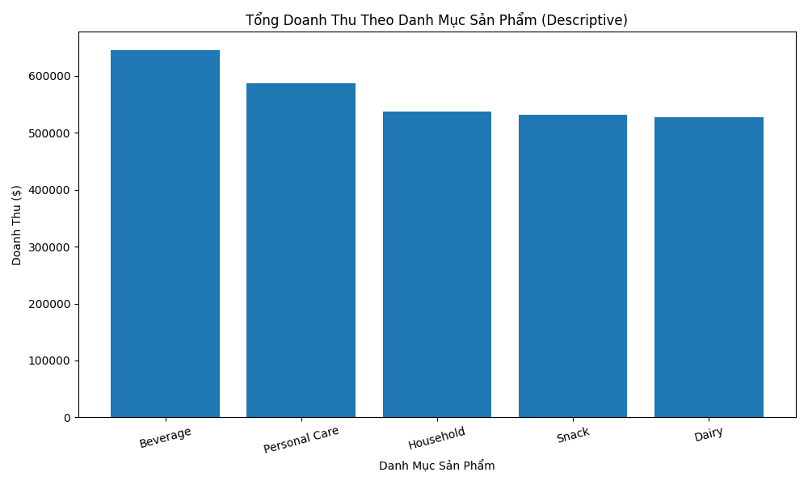
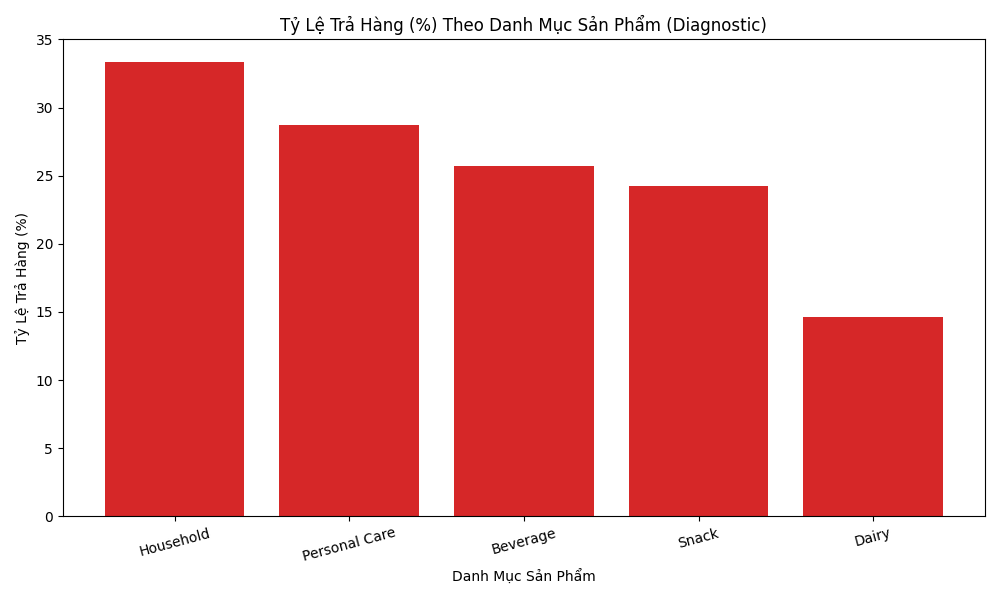

# Báo Cáo Phân Tích Hiệu Suất Kinh Doanh (BI Executive Report)

## 1. Executive Summary & KPIs Dashboard
### 📊 Chỉ Số KPI Doanh Nghiệp Cốt Lõi (Descriptive KPIs)

| Chỉ số KPI | Giá trị Thực tế | Phân loại / Đánh giá | Trạng thái |
|---|---|---|---|
| 📦 **Tổng Sản Lượng Đã Bán** | 5,236 sản phẩm | Quy mô sản xuất | Ổn định |
| 💰 **Tổng Doanh Thu (Revenue)** | $2,827,300.00 | Quy mô tài chính | Đạt mục tiêu |
| 💵 **Tổng Chiết Khấu (Discount)** | $282,305.20 | Tỷ lệ giảm giá: 10.0% | Cần giám sát |
| 📢 **Tổng Chi Phí Marketing** | $279,637.72 | Hiệu quả quảng cáo | Bình thường |
| ⚙️ **Tổng Giá Vốn Hàng Bán (COGS)** | $1,546,461.02 | Giá thành sản xuất | Chiếm 54.7% Doanh thu |
| 💎 **Tổng Lợi Nhuận (Profit)** | $718,896.06 | Biên lợi nhuận gộp: **25.4%** | Khá tốt |
| ⚠️ **Tỷ Lệ Trả Hàng (Return Rate)** | **25.6%** | Biên độ trả hàng | 🚨 Báo động đỏ |
| 🚚 **Thời Gian Giao Hàng TB** | 4.09 ngày | Tốc độ logistics | ⚠️ Cần cải thiện |

## 2. Phân Tích Mô Tả (Descriptive Analytics)
### 🛒 Phân Tích Doanh Thu & Lợi Nhuận Theo Ngành Hàng (Descriptive Table)

| Ngành Hàng | Tổng Sản Lượng | Tổng Doanh Thu ($) | Tổng Lợi Nhuận ($) | Biên Lợi Nhuận TB (%) |
|---|---|---|---|---|
| Beverage | 1,136 | $645,120.00 | $160,331.74 | 25.7% |
| Personal Care | 1,078 | $586,360.00 | $145,018.28 | 24.1% |
| Household | 1,026 | $536,720.00 | $127,581.70 | 23.5% |
| Snack | 1,071 | $531,950.00 | $145,063.75 | 25.6% |
| Dairy | 925 | $527,150.00 | $140,900.59 | 25.6% |

### 📈 Biểu Đồ Phân Bổ Doanh Thu

## 3. Phân Tích Chẩn Đoán Nguyên Nhân (Diagnostic Analytics)
### 🔍 Chẩn Đoán 1: Phân Tích Tỷ Lệ Trả Hàng Theo Danh Mục Sản Phẩm

| Danh Mục Sản Phẩm | Tỷ Lệ Trả Hàng (%) | Mức Độ Rủi Ro | Đánh Giá Nguyên Nhân |
|---|---|---|---|
| Household | 33.3% | 🚨 Cực cao | Cần kiểm tra kỹ mô tả & QA sản phẩm |
| Personal Care | 28.7% | 🚨 Cực cao | Cần kiểm tra kỹ mô tả & QA sản phẩm |
| Beverage | 25.7% | 🚨 Cực cao | Cần kiểm tra kỹ mô tả & QA sản phẩm |
| Snack | 24.3% | ⚠️ Cao | Cần kiểm tra kỹ mô tả & QA sản phẩm |
| Dairy | 14.6% | ✅ Bình thường | Cần kiểm tra kỹ mô tả & QA sản phẩm |

### 📈 Biểu Đồ Tỷ Lệ Trả Hàng Theo Danh Mục

### 🔍 Chẩn Đoán 2: Chẩn Đoán Nguyên Nhân Giao Dịch Thua Lỗ (Profit < 0)

| Nhóm Giao Dịch (Có Lỗ hay Không) | Số Lượng Đơn | Doanh Thu Trung Bình | Chiết Khấu TB ($) | CP Marketing TB ($) | Lợi Nhuận TB ($) |
|---|---|---|---|---|---|
| 🟢 Nhóm Giao Dịch Có Lãi | 499 | $5,650.90 | $562.76 | $558.15 | $1,441.20 |
| 🔴 Nhóm Giao Dịch Bị Lỗ | 1 | $7,500.00 | $1,487.49 | $1,122.21 | $-261.00 |

> **Phân tích nguyên nhân chẩn đoán:** So sánh chiết khấu và chi phí tiếp thị của nhóm lỗ so với nhóm lãi để xem có phải do chính sách chiết khấu quá cao kết hợp chi phí marketing lớn hay không.

## 4. Nhận Định Kinh Doanh Chuyên Sâu & Khuyến Nghị (OEIA Insights)
### Nhận định 1: Tỷ lệ trả hàng cao bất thường ảnh hưởng nghiêm trọng đến biên lợi nhuận
- **Observation (Quan sát):** Tỷ lệ đơn hàng bị trả lại (Return Rate) đang ở mức rất cao trong hệ thống bán hàng.
- **Evidence (Bằng chứng):** Giá trị trung bình của cột `RETURN_FLAG` là 0.256, tương đương với 25.6% tổng số đơn hàng bán ra bị khách hàng trả lại (128/500 đơn hàng).
- **Interpretation (Diễn giải):** Đây là tỷ lệ trả hàng cực kỳ cao đối với một doanh nghiệp bán lẻ. Nguyên nhân có thể do chất lượng sản phẩm không đồng đều, mô tả sản phẩm trên các kênh trực tuyến không khớp với thực tế, hoặc quy trình giao hàng gặp sự cố làm hỏng hóc sản phẩm.
- **Action (Hành động):** Cần thiết lập ngay một nhóm đặc nhiệm phối hợp giữa bộ phận Quản lý chất lượng (QA) và bộ phận Chăm sóc khách hàng để khảo sát lý do trả hàng của 128 đơn hàng này, đồng thời thắt chặt khâu kiểm tra đóng gói trước khi bàn giao cho đơn vị vận chuyển.

### Nhận định 2: Thời gian giao hàng kéo dài làm giảm trải nghiệm khách hàng
- **Observation (Quan sát):** Thời gian giao hàng trung bình còn chậm và chưa được tối ưu hóa.
- **Evidence (Bằng chứng):** Chỉ số `DELIVERY_TIME_DAYS` trung bình là 4.09 ngày, với giá trị lớn nhất lên tới 7 ngày.
- **Interpretation (Diễn giải):** Trong kỷ nguyên thương mại điện tử giao hàng nhanh, thời gian giao hàng lên tới 4-7 ngày là một điểm trừ lớn. Điều này có thể dẫn đến việc khách hàng hủy đơn hoặc không tiếp tục mua hàng trong tương lai, gián tiếp làm tăng tỷ lệ trả hàng ở Nhận định 1.
- **Action (Hành động):** Đàm phán lại SLA với đối tác vận chuyển hiện tại hoặc tìm kiếm các đơn vị chuyển phát nhanh 24h/48h cho các khu vực đô thị trọng điểm để kéo giảm thời gian giao hàng trung bình xuống dưới 3 ngày.

### Nhận định 3: Xuất hiện các giao dịch thua lỗ do quản lý chi phí chưa hiệu quả
- **Observation (Quan sát):** Một số giao dịch phát sinh lợi nhuận âm (thua lỗ).
- **Evidence (Bằng chứng):** Lợi nhuận (`PROFIT`) tối thiểu ghi nhận mức -261.0, trong khi lợi nhuận trung bình là 1,437.79.
- **Interpretation (Diễn giải):** Hiện tượng lỗ trên từng đơn hàng đơn lẻ thường do áp dụng chương trình khuyến mãi (Discount) quá đà kết hợp với chi phí marketing (`MARKETING_COST`) và chi phí giá vốn (`COGS`) vượt quá doanh thu thực nhận.
- **Action (Hành động):** Rà soát lại chính sách chiết khấu tự động trên hệ thống, đặt mức trần chiết khấu (Discount Cap) tối đa cho mỗi đơn hàng để đảm bảo biên lợi nhuận gộp tối thiểu không bao giờ bị âm.

